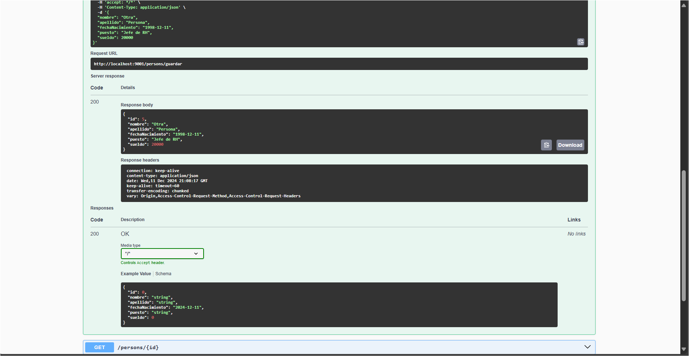
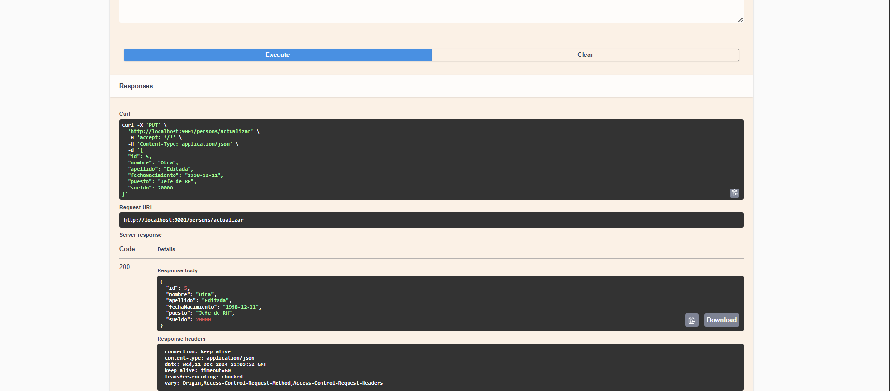
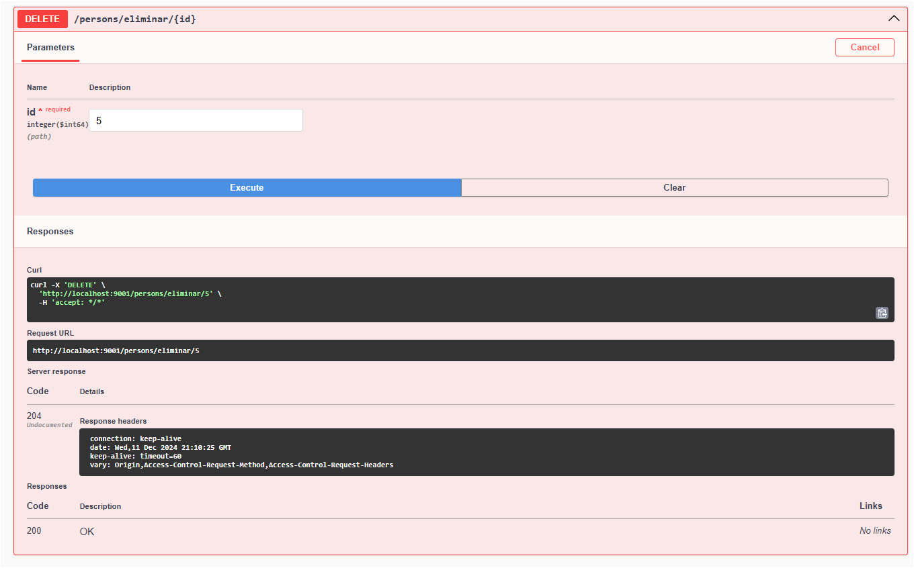

# Backend - Gestión de Personas

Este proyecto es un **CRUD RESTful** desarrollado en **Spring Boot** que permite gestionar la entidad `Person`. Incluye funcionalidades para listar, crear, editar y eliminar personas, conectado a una base de datos MySQL. 

## Configuración Inicial

Para que el backend funcione correctamente, lo configuré de la siguiente manera: 

1. **Base de Datos:**  
   - Nombre: `bd_flores`  
   - Tabla: `person` con las siguientes columnas:
     - `id` (INT, autoincremental)
     - `nombre` (VARCHAR)
     - `apellido` (VARCHAR)
     - `fechaNacimiento` (DATE)
     - `puesto` (VARCHAR)
     - `sueldo` (DECIMAL)
   - Usuario: `jdfr`
   - Contraseña: `jdfr`

   El archivo `application.properties` está configurado con estos datos:  
   ```properties
   spring.datasource.url=jdbc:mysql://localhost:3306/bd_flores
   spring.datasource.username=jdfr
   spring.datasource.password=jdfr
   spring.jpa.hibernate.ddl-auto=update
   spring.jpa.properties.hibernate.dialect=org.hibernate.dialect.MySQLDialect
   server.port=9001
   ```

2. **Estructura del Proyecto:**  
   El backend sigue una estructura modular:  
   - **`Models`:** Contiene la clase `Person`, que está anotada como una entidad JPA.  
   - **`Repositories`:** Define la interfaz `PersonRepository` para las operaciones de base de datos.  
   - **`Services`:** Contiene la lógica de negocio en `PersonService`.  
   - **`Controllers`:** Exponen las APIs REST a través de `PersonController`.  

## Funcionalidades

### Endpoints
Todos los endpoints siguen la convención RESTful y responden en formato JSON.

1. **Listar Personas**  
   - **Método:** `GET`  
   - **Ruta:** `/persons/listar`  
   - **Descripción:** Devuelve una lista de todas las personas en la base de datos.  
   - **Respuesta Ejemplo:**
     ```json
     {
       "status": true,
       "msg": "Consulta exitosa",
       "data": [
         {
           "id": 1,
           "nombre": "Juan",
           "apellido": "Pérez",
           "fechaNacimiento": "1990-05-15",
           "puesto": "Ingeniero",
           "sueldo": 15000.00
         }
       ]
     }
     ```

2. **Obtener Persona por ID**  
   - **Método:** `GET`  
   - **Ruta:** `/persons/{id}`  
   - **Descripción:** Devuelve los detalles de una persona según el ID proporcionado.  

3. **Crear Persona**  
   - **Método:** `POST`  
   - **Ruta:** `/persons/guardar`  
   - **Cuerpo Ejemplo:**
     ```json
     {
       "nombre": "María",
       "apellido": "López",
       "fechaNacimiento": "1985-08-10",
       "puesto": "Gerente",
       "sueldo": 20000.00
     }
     ```  

4. **Editar Persona**  
   - **Método:** `PUT`  
   - **Ruta:** `/persons/actualizar`  
   - **Cuerpo Ejemplo:** Igual que el de creación, pero incluye el ID.

5. **Eliminar Persona**  
   - **Método:** `DELETE`  
   - **Ruta:** `/persons/eliminar/{id}`  

## Pruebas

Probé el backend utilizando **Postman** con las siguientes pruebas:

1. **Probar la Conexión a la Base de Datos:**  
   Iniciar el backend y verificar que no arroje errores de conexión. El puerto configurado es el `9001`.  

2. **Pruebas de CRUD:**  
   - Hice una inserción inicial con el endpoint `POST /persons/guardar`.  
   - Listé todas las personas con `GET /persons/listar`.  
   - Probé la edición con `PUT /persons/actualizar`.  
   - Finalmente, probé la eliminación con `DELETE /persons/eliminar/{id}`.  

3. **Estructura de Respuestas:**  
   Validé que todas las respuestas incluyeran las propiedades `status`, `msg`, y `data`, cumpliendo con la especificación.

## Capturas de Pantalla

Incluí algunas capturas de mis pruebas en Postman:

### Listar Personas


### Crear Persona


### Editar Persona


### Eliminar Persona


## Despliegue

1. **Compilar y Ejecutar:**  
   Navegar a la raíz del proyecto y compilar el backend:  
   ```bash
   mvn clean install
   ```  
   Luego, ejecutar:  
   ```bash
   mvn spring-boot:run
   ```

2. **Puerto de Ejecución:**  
   Por defecto, el backend estará disponible en [http://localhost:9001](http://localhost:9001).  

3. **Verificar el Estado:**  
   Acceder a `/persons/listar` para comprobar que el backend responde correctamente.

---

Este backend está diseñado para ser extensible y modular, lo que permite fácilmente agregar nuevas funcionalidades en el futuro.

