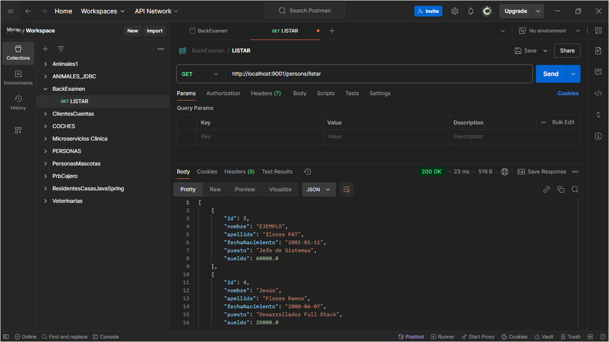
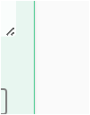

# Frontend - Gestión de Personas

Este proyecto incluye el frontend desarrollado en **Angular** para gestionar la entidad `Person`. Permite listar, agregar, editar y eliminar personas conectándose al backend desarrollado en Spring Boot.

## Requerimientos

- **Node.js** versión 18.16.1 o superior.
- **Angular CLI** instalado globalmente:
  ```bash
  npm install -g @angular/cli
  ```
- Un servidor backend funcionando localmente, configurado con los datos de conexión de MySQL.

## Configuración y Despliegue

1. **Clonar este repositorio:**
   ```bash
   git clone https://github.com/YaguarWillRockJDFR/tesffullstack_flores.git
   ```
   Cambiar a la rama correspondiente:
   ```bash
   git checkout flores_frontend
   ```

2. **Instalar las dependencias del proyecto:**
   Navegar a la carpeta del frontend y ejecutar:
   ```bash
   cd Frontend
   npm install
   ```

3. **Configurar el archivo `application.properties` del backend:**
   El backend debe estar configurado para conectarse a la base de datos con los siguientes datos:
   ```properties
   spring.datasource.username=jdfr
   spring.datasource.password=jdfr
   ```

4. **Ejecutar el frontend localmente:**
   Para iniciar el servidor de desarrollo, ejecutar:
   ```bash
   ng serve
   ```
   Esto abrirá la aplicación en [http://localhost:4200](http://localhost:4200).

## Funcionalidades

1. **Listar Personas:**
   - Botón **"Lista de Personas"** en la barra de navegación.
   - Muestra todas las personas registradas en la base de datos.
   - Cada registro incluye botones para editar o eliminar.

2. **Registrar Nueva Persona:**
   - Botón **"Registrar Persona Nueva"** en la barra de navegación.
   - Abre un formulario para agregar una nueva persona.

3. **Editar Persona:**
   - Desde la lista de personas, presionar el botón **"Editar"** en el registro deseado.
   - Carga los datos existentes en un formulario editable.

4. **Eliminar Persona:**
   - Desde la lista de personas, presionar el botón **"Eliminar"** en el registro deseado.
   - Solicita confirmación antes de eliminar.

## Componentes

- **`AppComponent`:** Componente principal que organiza las rutas y la barra de navegación.
- **`ListPersonComponent`:** Componente para listar las personas.
- **`EditPersonComponent`:** Componente para registrar y editar personas.

## Capturas de Pantalla

### Pantalla de Listado

### Pantalla de Edición

### Pantalla de Registro

### Eliminación

## Rutas

- `/persons`: Lista todas las personas.
- `/persons/add`: Abre el formulario para registrar una nueva persona.
- `/persons/edit/:id`: Abre el formulario para editar la persona con el ID especificado.

## Notas

- Este proyecto utiliza **Bootstrap 5.3** para los estilos.
- El backend debe estar corriendo en el puerto `9001` (configuración por defecto en `application.properties`).
- El archivo `person.service.ts` contiene la configuración de las rutas de API que el frontend consume.
